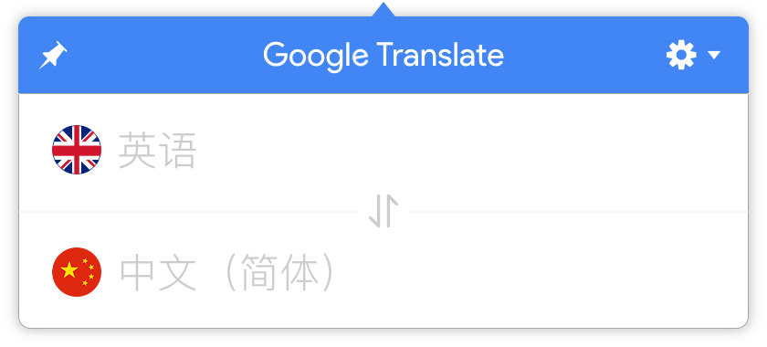

# Google Translate

> Google 翻译 Mac 客户端（基于官方 API）

## 截图

## 功能
- [ x ] 基本翻译
- [ x ] 语音朗读
- [ x ] 顶端显示
- [ x ] 开机启动
- [ x ] 自动更新
- [ x ] 全局快捷键呼出
- [ x ] 内置多种翻译引擎

## 依赖模块

- [anime](https://github.com/juliangarnier/anime) JavaScript 动画引擎
- [auto-launch](https://github.com/Teamwork/node-auto-launch) 在登录时启动应用程序或可执行文件（Mac，Windows 和 Linux）
- [axios](https://github.com/mzabriskie/axios) 用于浏览器和 Node.js 的基于 Promise 的 HTTP 客户端
- [electron-referer](https://github.com/akameco/electron-referer) 修改 Electron 默认 Referer 请求头
- [marked](https://github.com/chjj/marked) 更新说明 Markdown 解析
- [menubar](https://github.com/maxogden/menubar) 让 Electron 窗口以通知栏气泡的形式显示
- [request](https://github.com/request/request) 在 Node 端简化 HTTP 请求
- [request-progress](https://github.com/IndigoUnited/node-request-progress) 为 [request](https://github.com/request/request) 模块提供下载进度功能
- [translation.js](https://github.com/Selection-Translator/translation.js) 用同一个方法调用多种翻译接口如有道翻译、百度翻译、谷歌翻译、必应翻译等
- [uuid](https://github.com/kelektiv/node-uuid) 在 JavaScript 中生成符合 RFC 的 UUID
- [v-hotkey](https://github.com/Dafrok/v-hotkey) 用于将热键绑定到组件的 Vue 2.x 指令
- [vue](https://github.com/vuejs/vue) 一种渐进的，逐步采用的 JavaScript 框架，用于在网络上构建 UI
- [vue-electron](https://github.com/SimulatedGREG/vue-electron) 将 Electron API 附加到 Vue 对象的插件，使其可以访问所有组件
- [vue-router](https://github.com/vuejs/vue-router) 为 Vue.js 提供路由功能
- [vuex](https://github.com/vuejs/vuex) 为 Vue.js 提供状态管理功能

## 协议

[GNU General Public License v3.0](LICENSE)  
本项目仅供学习交流和私人使用，禁止用作商业用途
